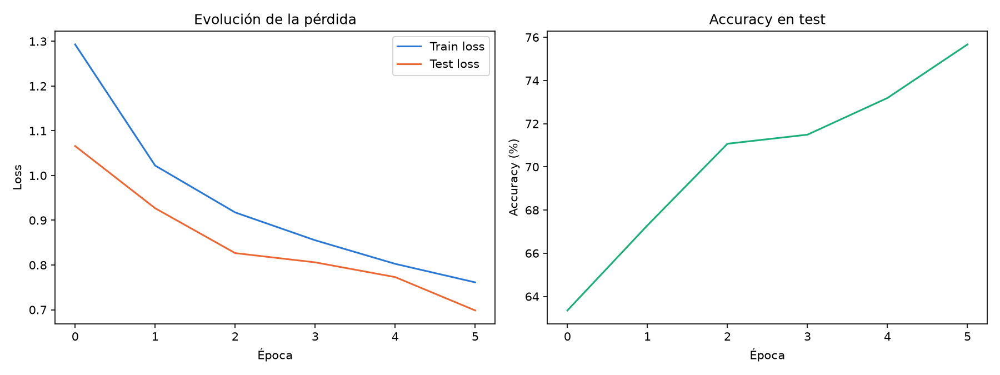
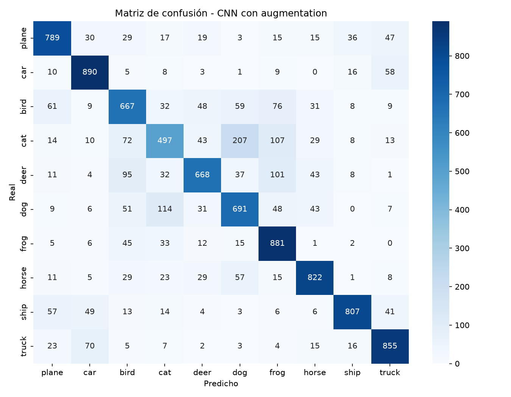
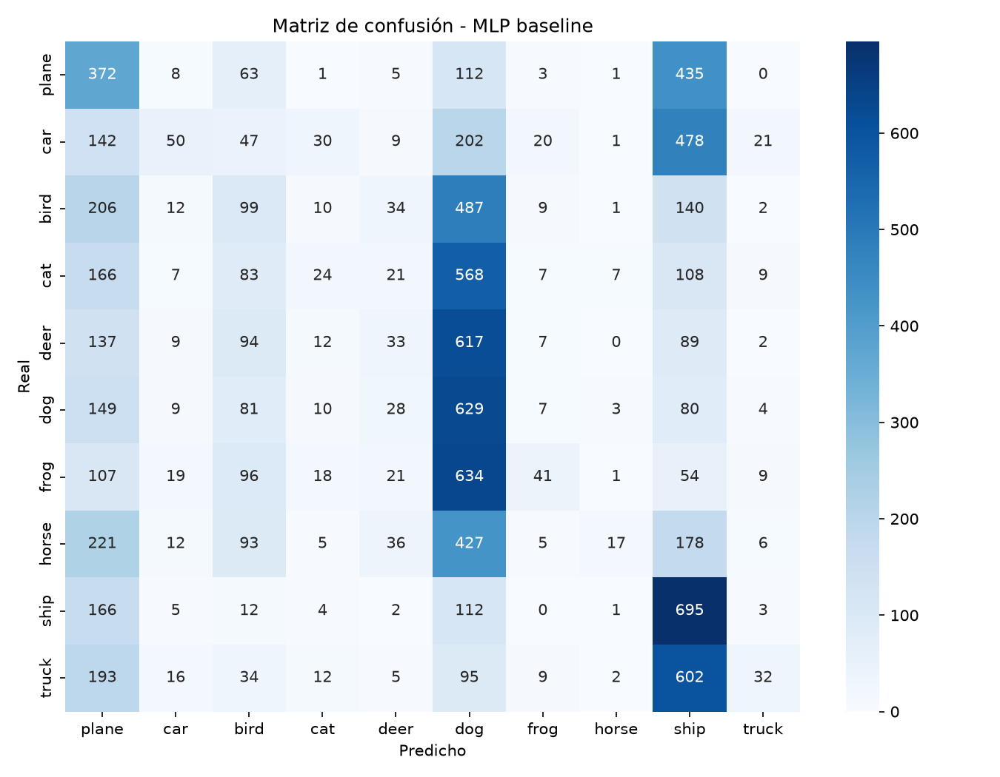

# CIFAR-10: Baseline MLP vs. CNN con Data Augmentation

Comparativa directa entre dos enfoques para clasificar las 10 clases de
CIFAR-10: una red totalmente conectada como referencia, y una CNN con
batch normalization, dropout y aumentado de datos (flips horizontales +
random crop) entrenada sobre el dataset original combinado con su versión
aumentada.

## Modelos

- **`SimpleMLP`** (baseline): red totalmente conectada, sin ninguna
  estructura convolucional, entrenada con SGD durante 10 épocas sobre las
  imágenes originales.
- **`AugmentedCNN`**: 2 bloques conv + batch norm + max pooling, dropout
  antes de las capas densas, entrenada con Adam y un scheduler de
  learning rate, sobre `ConcatDataset([original, aumentado])`.

## Resultados

| Modelo | Accuracy (test) |
|---|---|
| MLP baseline | 19.9% |
| CNN + augmentation | **75.7%** |

Un MLP sin convoluciones apenas mejora el azar (10% con 10 clases) — es exactamente lo esperable, y sirve para dimensionar cuánto aporta la arquitectura convolucional junto con el data augmentation: casi 4x la accuracy del baseline.





## Uso

```bash
pip install -r requirements.txt

python train_baseline.py   # entrena el MLP (descarga CIFAR-10 automáticamente)
python train_cnn.py        # entrena la CNN con augmentation

# Clasificar tus propias imágenes
python predict_image.py --arch cnn --model outputs/cnn_augmented.pth foto.jpg
```

## Estructura

```
models.py           # arquitecturas (SimpleMLP, AugmentedCNN)
evaluate.py          # matriz de confusión + classification report (compartido)
train_baseline.py    # entrena y evalúa el MLP
train_cnn.py          # entrena y evalúa la CNN con augmentation
predict_image.py      # clasifica imágenes propias con cualquiera de los dos modelos
outputs/               # checkpoints, métricas y gráficas generadas por los scripts
```
